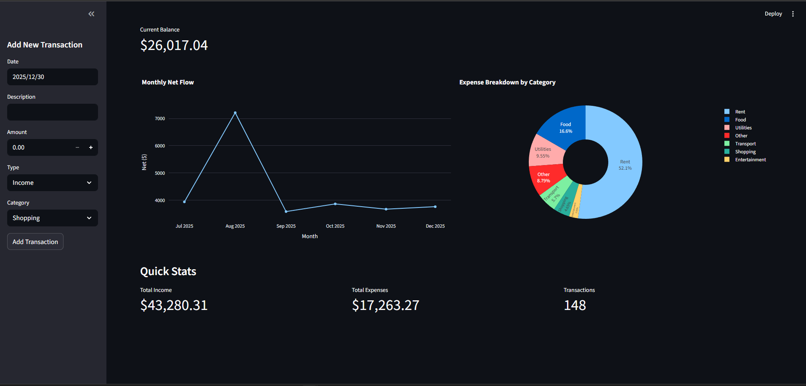

# 💰 Personal Finance Dashboard

An interactive web app for tracking income, expenses and spending trends, built with Streamlit, pandas and Plotly.

---

## 🖥️ Screenshot

---

## ✨ Features

- Add transactions manually from the sidebar, or import them from a CSV file
- Running balance and monthly net cash flow
- Interactive category breakdown of expenses (pie chart)
- Three views: **Overview**, **Transactions** and **Insights**, plus quick stats
- Data persists between sessions in CSV storage

---

## 🧰 Tech Stack

- **Python** for the app logic
- **Streamlit** for the UI and interactivity
- **pandas** for data processing
- **Plotly** for interactive charts

---

## 💻 Code

Source code and setup instructions: [github.com/chigozie9/personal-finance-dashboard](https://github.com/chigozie9/personal-finance-dashboard)
