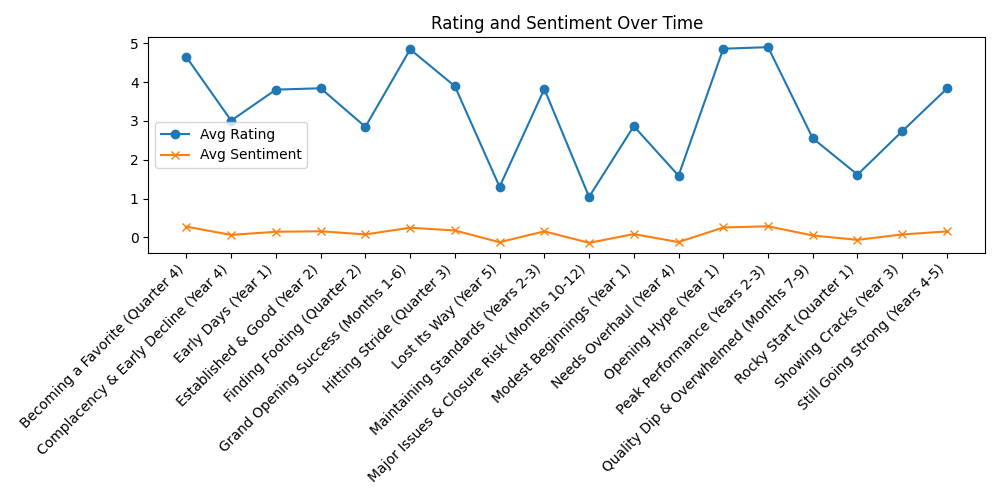
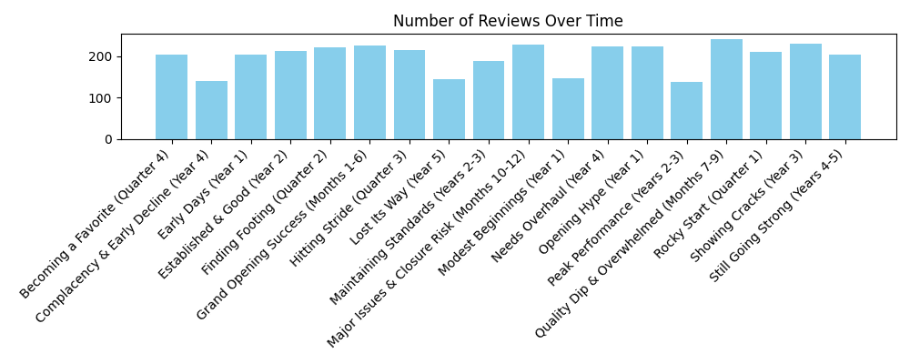
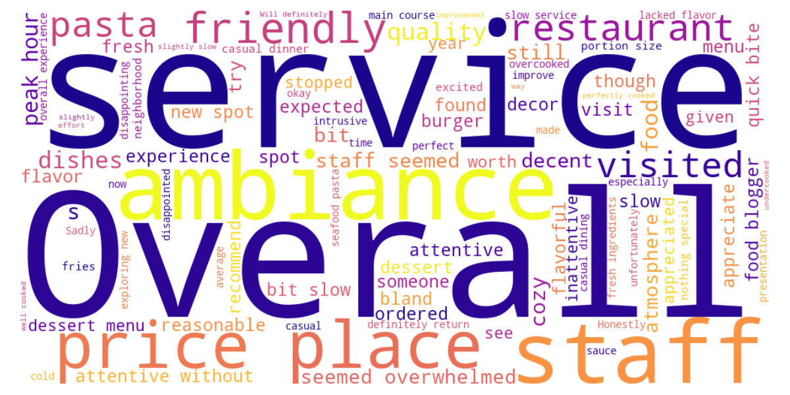

# 📊 Restaurant Review Trends Over Time

This project explores how customer sentiment and review volume evolved over time for various restaurants. We used natural language processing (NLP) to extract sentiment from review text and visualized how it correlated with rating trends.

---

## 🧠 Tools & Techniques

- **Pandas** for data cleaning
- **TextBlob** for sentiment scoring
- **Matplotlib** for visualizations
- **WordCloud** for text frequency visualization
- **Streamlit** (optional) for interactive dashboard

---

## 📈 Timeline of Reviews

---

## 🔍 Sentiment by Restaurant

---

## ☁️ Most Frequent Words in Reviews

We visualized the most commonly used words across all reviews to identify recurring themes in customer feedback.

---

## 📓 Notebook

Check out the code in the notebook:
[`restaurant_eda.py`](data/restaurant_eda.py)

---

## 🧾 Summary

This project shows how customer feedback evolves and how NLP can provide actionable business insights.
This type of analysis is useful for marketing, operations, and quality control in customer-facing industries.
