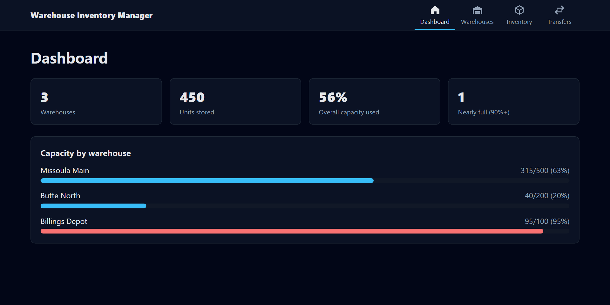
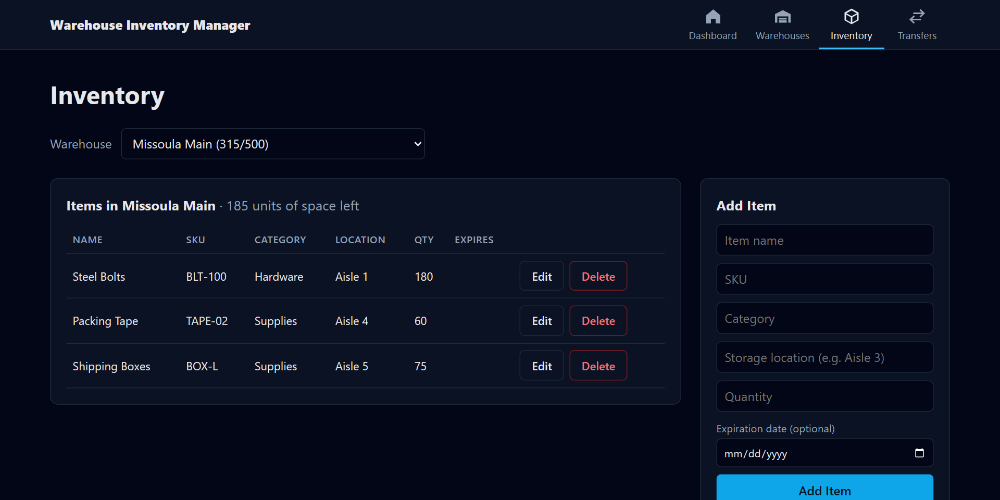
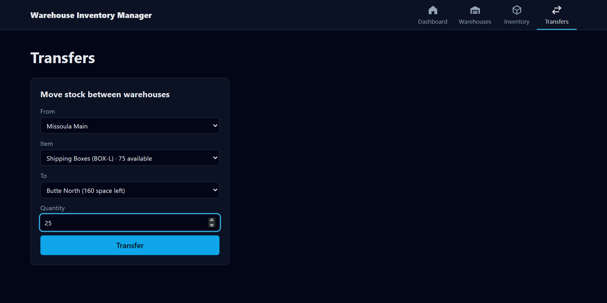

# 🏭 Warehouse Inventory Manager + Test Automation Suite

A full-stack inventory app (Spring Boot, PostgreSQL, React) with an automated **API + UI test suite** built in
**pytest** and **Playwright** that runs in **GitHub Actions** on every push. The suite found **6 real bugs**,
which I then fixed.

[](https://github.com/chigozie9/WareHouse/actions/workflows/tests.yml)

📂 **Code:** [github.com/chigozie9/WareHouse](https://github.com/chigozie9/WareHouse)

---

## 🧰 Tech Stack

- **Backend:** Java 17, Spring Boot 3, Spring Data JPA, PostgreSQL, REST APIs
- **Frontend:** React 19, React Router, Vite
- **Testing:** Python, pytest, requests, Playwright, pytest-html
- **CI:** GitHub Actions with a PostgreSQL service container

---

## 🖥️ The App

The app manages warehouses, the stock inside them, and transfers between them, while enforcing
capacity limits. Each feature has its own page behind a nav bar.







---

## 🧪 Test Strategy

**66 automated tests**, all independent: each one creates its own uniquely named data and cleans it up.

**API tests (pytest + requests)** cover the business logic:

- Happy paths for every endpoint: create, read, update, delete, transfer
- **Capacity accounting** after every change, verified by reading the data back from the API
- **Boundary values:** filling a warehouse exactly to capacity, quantity 0 vs. -5, shrinking capacity just below current stock
- **Negative paths:** unknown IDs, wrong warehouse, transfer to the same warehouse, not enough stock or space
- **No partial updates:** after a rejected request, the data is checked to be unchanged
- **Error contract:** bad input must return a clear 4xx, never a 500 or a stack trace

**UI tests (Playwright)** cover what a user does: nav bar routing, dashboard capacity bars, creating, editing
and deleting warehouses, managing inventory, running a transfer end to end, form validation, and error banners.
Backend failures are simulated with `page.route()` so error states can be tested without breaking real data.

**CI (GitHub Actions)** starts a real PostgreSQL container, builds and runs the backend and frontend, runs the
whole suite, and uploads an HTML test report.

---

## 🐞 Bugs Found by the Suite

I wrote tests for the *correct* behavior first. Where the app was wrong, I marked the test as an expected
failure (`xfail`, strict mode), so CI stayed green while the bugs were tracked. When I fixed the bugs, strict
mode flagged each test as now passing, and they became permanent regression tests.

| Bug | Before | After the fix |
|---|---|---|
| Invalid input (missing name, negative quantity, transfer of 0) | 500 server error | 400, naming each bad field |
| Duplicate warehouse name | 500, and the UI showed "Unexpected server error" | 409 "A warehouse named X already exists." |
| Malformed JSON | 500 | 400 |
| Changing an item's SKU to one already in the warehouse | Allowed; later transfers crashed with 500 | 409, nothing changed |
| Listing items for a warehouse that doesn't exist | 200 with an empty list | 404 |
| Editing an item's expiration date | Silently ignored | Saved |

The first three shared one root cause: the API's global error handler had no cases for validation errors,
unreadable JSON or database constraint violations, so all of them fell through to the generic 500 handler.

```text
$ pytest
..................................................................  [100%]
66 passed in 6.31s
```
